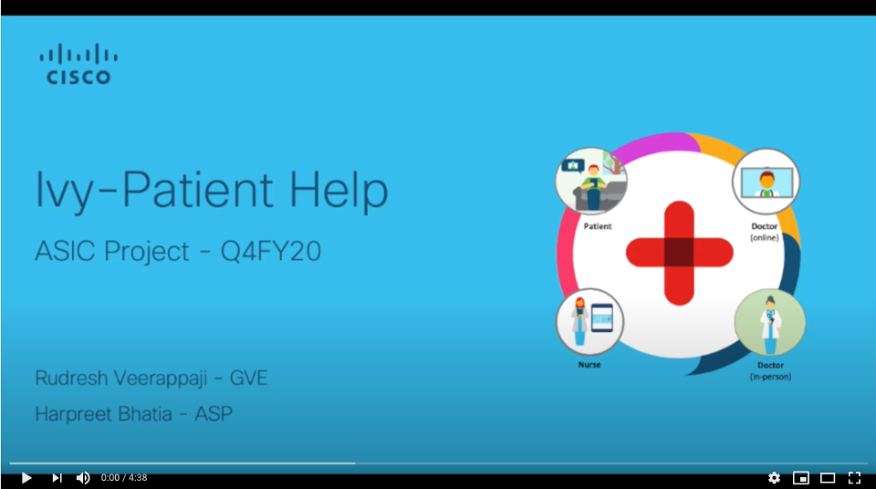

# Ivy - Patient Help
Healthcare in your palms!

<p align="center">
  
</p>
 
  
## Use case / Introduction

Healthcare just like any other industry is undergoing rapid digitization, and in the recent past this the need for this has increase many fold due to COVID resulting in complete and partial lockdowns making it difficult for patients to get the medical care at the right time on one hand, and on the other the medical systems are overwhelmed by the increased load. There is no better time than now to leverage tecnologies and solutions to solve the issues of Healthcare vertical, and address areas of faster diagnosis, faster access to front line medical staff and doctors. With this goal in mind, we have designed a solution that addresses some of these issues, by leveraging Cisco's collaboration and networking products by building on top of the open and programmable principles that these are built upon.

## Problem statement

Healthcare experience for both patients and medical staff including doctors needs to drastically improve by adopting technologies, especially in this near reality of a spreading pandemic, resulting partial/complete lockdowns and overwhelmed medical infrastructures across the world. Now more than ever there is need for faster intial diagnosis, access to front line medical staff and to doctors by leveraging technologies that enable optimizations including virtual services.

## Solution


#### Workflow-1
##### Non Critical - Preliminary diagnosis & Appointment booking
A patient accesses hospital portal online through a smartphone, securely shares symptoms to a anchor module powered by Webex teams, and the bot module does prelimary analysis of the symptoms & directs the patient to a nurse or doctor based on the criticality of the illness. Bot module will check the expertize, schedule and availability of doctors and book an appointment for the earliest available slot and shares this information to both patient & nurse/doctors.

<p align="center">
  
</p>

#### Workflow-2
##### Critical - Preliminary diagnosis & Immediate virtual assistance

If the illness is critical based on the prelimnary analysis of the symptoms, bot module will find a resource based on doctor/Nurse's webex team space status (which can be either manually set by the person or automatic detection like whether on call or not on duty or etc) and if the status is available and on duty, the best available doctor that matches medical expertise to the symptoms of the patient will be picked, and a webex video call will be initiated. Further, vitals and test reports sharing, digital prescription sharing etc can be used by leveraging the webex teams services.

<p align="center">
  
</p>


## Solution Components
 
* Webex Teams
* Webex DX80 (optional)
* HTML
* Python
* Ngrok (optional)
 

## Solution workflow

<p align="center">
  
</p>

## Cisco Products
* Cisco Webex Teams
* Cisco Webex DX80 (Optional)
 
## Demo

The following demo illustrates the above described two major use cases of a patient leveraging our solution (<b> additional use cases are work in progress </b>) to use the healthcare services of a ficticious hospital called "Medi-Plus+".


[](https://youtu.be/-q5kTo_u4I4)

## Prerequisites
* Python 3.x
* Text editor
* Flask
* Webex bot token
* Webex guest issuer app id and secret
* Python libraries in req.txt

## Installation

1. Clone this repository <b>Change after pushing the repo to CiscoSE</b>
```
git clone https://wwwin-github.cisco.com/abhr/patient-help.git
```

2. Configure a .env file in the code directory under config folder with all the necessary environment variables
```
BOT_EMAIL = 'Bot Email'
BOT_TOKEN = 'Bot Token'
BOT_URL = 'Bot URL'
BOT_NAME = 'Bot Name'
GUEST_ISSUER_ID = 'Guest Issuer APP ID'
GUEST_ISSUER_SECRET = 'Guest Issuer APP Secret'
```

3. Create a virtual environment for the python code
```
python -m venv /path/to/new/virtual/environment
```

4. Activate the newly created virtual environment
```
source venv/bin/activate
```

5. Install the required libraries into the virtual environment
```
pip install -r req.txt
```

6. Run the bot.py on a publicly acessible URL using ngrok(used in this project)
```
Ngrok Docs - https://ngrok.com/docs

Start ngrok tunnel - ./ngrok http 8080
```

7. Run main.py to serve the main page using flask
```
FALSK_APP = main.py
flask run
```


## Conclusion

The solution proposed and validated here with the prototype, can be easily integrated in a Hospital or Medical environment by leveraging Cisco Webex teams, and achieve better user experience for patient & nurse/doctor interactions. 

Here are the top benefits of using this solution:
  1. Reduced time for adoption : Quick adoption of the solution without the need for network redesign of physical infrastructure.
  2. Improved patience and nurse/doctor experience even while being remote : Any device, any where, any time
  3. Faster response times for both prelimary diagnosis and subsequent diagnosis.
  4. Option Video integrations like with DX for better video experience.
  5. Digital prescription using whiteboard or other such tools integration
  6. Sensors like Apple Watch, etc that measure medical vitals like pulse rate, respiration rate, heart rate, BP, temperature etc can be remotely measured integrated to the solution.
  7. AI/ML integration to enhance prelimary diagnosis, on top of the platform that this solution provides.
  8. Replicable solution model which can be adapted to any other industry for similar benefits

## Authors

* Rudresh Veerappaji (rudv@cisco.com)
* Harpreet Bhatia (harbhati@cisco.com)


## DISCLAIMER:
Please note: This script is meant for demo purposes only. All tools/ scripts in this repo are released for use "AS IS" without any warranties of any kind, including, but not limited to their installation, use, or performance. Any use of these scripts and tools is at your own risk. There is no guarantee that they have been through thorough testing in a comparable environment and we are not responsible for any damage or data loss incurred with their use. You are responsible for reviewing and testing any scripts you run thoroughly before use in any non-testing environment.
